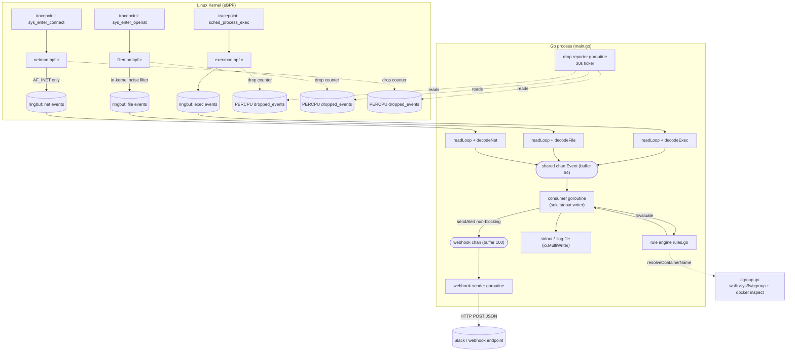

# TraceGuard — Technical Architecture

> Source of truth: `main.go`, `rules.go`, `cgroup.go`, `webhook.go`,
> `bpf/*.bpf.c`, and the bpf2go-generated `*_bpf{el,eb}.go`. Architectural
> rationale is narrated in `DESIGN.md`.

## 1. High-level architecture

TraceGuard is a **single-process, multi-goroutine pipeline**. There is no
client/server, no frontend, no datastore. The "backend" is the kernel (eBPF
programs); the "application" is one Go binary that reads from the kernel and
writes alerts.



### The one pattern, used three times
Every monitor is deliberately identical in shape (`DESIGN.md` §1):

```
eBPF program (tracepoint)
  -> BPF_MAP_TYPE_RINGBUF            (per-monitor ring buffer)
   -> ringbuf.Reader                 (one reader goroutine per monitor)
    -> decode raw sample             (decodeExec / decodeFile / decodeNet)
     -> unified Event                (rules.go Event struct)
      -> shared channel              (single consumer = sole stdout writer)
       -> Evaluate(event, ruleConfig)
        -> alert JSON                (stdout, log file, webhook)
```

Adding the network monitor was, by design, "a third reader goroutine on the same
channel" with no rule-engine or consumer changes.

## 2. Major components

| Component | File(s) | Responsibility |
| --- | --- | --- |
| Pipeline / lifecycle | `main.go` | Flag parsing, rule load, memlock, load+attach 3 eBPF programs, spawn reader/reporter/consumer goroutines, decode samples, graceful shutdown. |
| eBPF programs | `bpf/execmon.bpf.c`, `bpf/filemon.bpf.c`, `bpf/netmon.bpf.c` | Capture kernel events, fill fixed-layout `struct event`, submit to ring buffer, bump drop counter on backpressure. |
| Generated bindings | `*_bpf{el,eb}.go`, `*_bpf{el,eb}.o` | bpf2go output: embedded object bytes + Go structs (`execmonEvent` etc.) + `loadXObjects`/`XObjects` accessors. **Committed, never hand-edited.** |
| Rule engine | `rules.go` | `Event`/`RuleConfig`/`Alert` types + four `eval*` evaluators + `Evaluate`. |
| Rule config | `rules.yaml` | The four rule categories with their knobs. |
| Container resolution | `cgroup.go` | cgroup id → container name (walk cgroupfs + `docker inspect`), memoized. |
| Webhook sender | `webhook.go` | Single goroutine draining an alert channel, POSTing Slack-compatible JSON. |
| Validation suite | `validate/` | Attack/benign command suite + time-window scorer + report. |
| Perf scripts | `perf_test.sh`, `perf_steadystate.sh` | CPU overhead measurement (verbose vs steady-state). |

## 3. Concurrency model

`run()` in `main.go` orchestrates these goroutines:

- **3 reader goroutines** (`readLoop`), one per ring buffer. Each blocks on
  `rd.Read()`, decodes, and sends to the shared `out chan Event` (buffer 64).
- **1 drop-reporter goroutine**: 30s ticker; sums per-CPU `dropped_events` and
  warns on stderr if a counter climbed. Stops on `reporterStop`.
- **1 consumer goroutine**: the **sole writer to stdout/log**. Optionally prints
  raw events (`-verbose`), runs `Evaluate`, prints each alert, and mirrors it to
  the webhook channel via non-blocking `sendAlert`.
- **1 webhook-sender goroutine** (only if `-webhook` set): ranges the webhook
  channel, POSTs each alert (5s HTTP client timeout).
- **1 signal goroutine**: on SIGINT/SIGTERM closes all three ring readers (so
  each `Read` returns `ringbuf.ErrClosed`) and closes `reporterStop`.

### Why a single consumer
Two monitors firing simultaneously must never interleave a half-written JSON line
on stdout. Funneling all events through one channel into one writer guarantees
line atomicity without per-write locking.

### Shutdown sequence (ordering matters)
```
SIGINT/SIGTERM
  -> close execRD/fileRD/netRD + close(reporterStop)
  -> 3 readers + reporter return -> wg.Wait() unblocks
  -> close(out)                      // no more events
  -> printer drains out, then close(done); <-done
  -> final drop summary printed (maps still open; closed by deferred .Close())
  -> if webhookCh != nil: close(webhookCh); webhookWG.Wait()  // flush queued alerts
  -> deferred Close() on readers, tracepoint links, objects
```
The WaitGroup counts **4** (`wg.Add(3)` + `wg.Add(1)` for the reporter); `out` is
only closed after all four exit, so every buffered event is flushed.

## 4. Backpressure & failure handling

- **Ring buffer full**: the eBPF side `bpf_ringbuf_reserve()` returns NULL; the
  program bumps a per-CPU `dropped_events` counter and returns 0 (event lost, no
  crash). Userspace surfaces the climb every 30s and a per-run total at exit.
- **Webhook channel full** (buffer 100): `sendAlert` uses `select { case ch<-a: default: drop+log }` — detection is **never blocked on network I/O**.
- **Ring read error (non-close)**: `readLoop` logs to stderr and **sleeps 100ms**
  before retrying, to avoid a tight loop pinning a core on a persistent error.
- **Decode error**: logged, event skipped, loop continues.
- **Container lookup failure**: `resolveContainerName` never errors — returns `""`
  or a `container:<shortid>` fallback; alerting proceeds regardless.

## 5. eBPF / CO-RE architecture

- Programs are built **CO-RE**: field offsets in hand-declared partial structs are
  relocated against the running kernel's BTF at load time (`preserve_access_index`
  + `BPF_CORE_READ`). No multi-megabyte `vmlinux.h` is generated (`DESIGN.md` §2).
- `execmon` reads `task_struct.real_parent->{tgid,comm}` in-kernel (avoids a
  `/proc` parent-name race — `DESIGN.md` §3).
- `filemon` and `netmon` read **userspace** argument pointers at the syscall
  boundary (`bpf_probe_read_user[_str]`), deliberately avoiding CO-RE against
  kernel socket/file internals (`DESIGN.md` §2: connect reads `sockaddr_in`, not
  `struct sock`).
- `filemon` runs an in-kernel noise filter (`has_sensitive_marker`, a bounded —
  not `#pragma unroll`ed — loop to stay under BPF's 512-byte stack and pass the
  verifier; `DESIGN.md` §2).

## 6. Output / API architecture

There is **no inbound API**. Outputs:
1. **stdout** (always) — JSON lines; alerts in all modes, raw events with `-verbose`.
2. **`-log-file`** — `io.MultiWriter(stdout, file)`; append mode.
3. **`-webhook`** — HTTP POST per alert (see [API_REFERENCE](./API_REFERENCE.md)).

## 7. State management, caching, jobs, queues

- **State**: effectively stateless across runs. In-memory only: drop counters
  (per-CPU eBPF maps), the `containerNameCache` (`sync.Map`), and channel buffers.
- **Caching**: `cgroup.go`'s `containerNameCache` memoizes cgroup-id → name
  (including `""` and fallbacks) so repeated alerts in one cgroup don't re-walk
  `/sys/fs/cgroup` or re-shell-out to `docker inspect`.
- **Background jobs**: the 30s drop reporter (internal ticker only).
- **Queues**: two in-process Go channels (`out` buffer 64, `webhookCh` buffer
  100). No external broker.

## 8. Authentication & authorization

- **No application-level auth/authz** — there are no users, sessions, or tokens.
- The only authorization that matters is **OS capability**: loading eBPF and
  attaching tracepoints requires root or `CAP_BPF`/`CAP_SYS_ADMIN` (+ debugfs for
  `perf_event_open`). This is enforced by the kernel, not by TraceGuard.
- The webhook URL is the only secret-ish input; it is validated for
  `http`/`https` scheme at startup and warned about if plaintext `http`.
</content>
