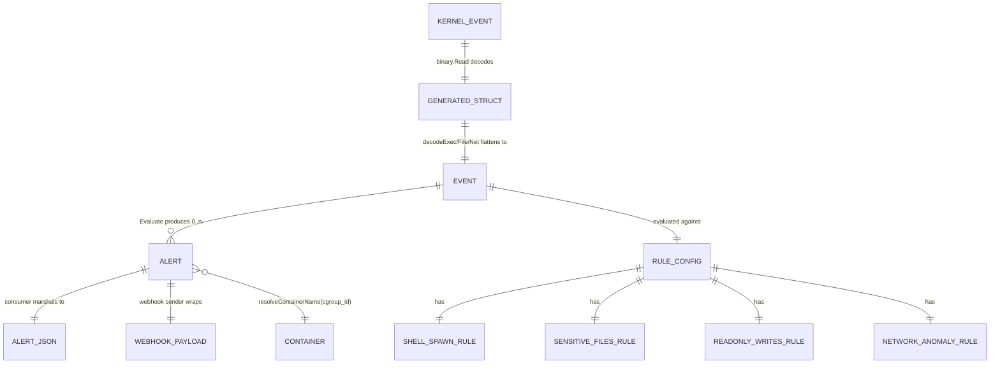

# TraceGuard — Data Models

> There is **no database**. "Data models" here are the in-memory Go structs and
> the wire-layout C structs that flow through the pipeline. Source: `rules.go`,
> `main.go`, `bpf/*.bpf.c`, generated `*_bpfel.go`.

## 1. Model relationship overview



## 2. Kernel `struct event` (the wire format)

Each monitor defines its own `struct event` in C; bpf2go emits a matching Go
struct from its BTF. **Layout must stay in sync** — `binary.Read` with
`LittleEndian` reads raw bytes positionally.

### execmon (`bpf/execmon.bpf.c:20`) → `execmonEvent`
| Field | C type | Bytes | Meaning |
| --- | --- | --- | --- |
| `pid` | `__u32` | 4 | userspace PID (tgid) |
| `ppid` | `__u32` | 4 | parent tgid (`real_parent->tgid`) |
| `cgroup_id` | `__u64` | 8 | `bpf_get_current_cgroup_id()` |
| `comm` | `__u8[16]` | 16 | process command name |
| `parent_comm` | `__u8[16]` | 16 | parent comm, captured in-kernel |
| `filename` | `__u8[256]` | 256 | exec'd path (from `__data_loc`) |

### filemon (`bpf/filemon.bpf.c:37`) → `filemonEvent`
| Field | C type | Meaning |
| --- | --- | --- |
| `pid` | `__u32` | userspace PID |
| `flags` | `__u32` | raw `openat` flags (arg 2) |
| `cgroup_id` | `__u64` | cgroup id |
| `comm` | `__u8[16]` | process command name |
| `filename` | `__u8[256]` | opened path (userspace string) |

### netmon (`bpf/netmon.bpf.c:27`) → `netmonEvent`
| Field | C type | Meaning |
| --- | --- | --- |
| `pid` | `__u32` | userspace PID |
| `cgroup_id` | `__u64` | cgroup id |
| `dst_port` | `__u16` | destination port, **host byte order** (`bpf_ntohs` in-kernel) |
| `dst_ip` | `__u8[4]` | raw IPv4 bytes (kept as array to preserve dotted-quad order) |
| `comm` | `__u8[16]` | process command name |

> **Design note:** `dst_ip` is a 4-byte array (not `__u32`) so byte order is
> unambiguous on the Go side; `dst_port` is byte-swapped in-kernel so Go prints a
> plain integer (`netmon.bpf.c` comments).

## 3. Unified `Event` (rules.go:13)

The single normalized type every decoder produces. Not all fields apply to every
type (note `omitempty`).

| Field | Type | JSON | Populated for | Notes |
| --- | --- | --- | --- | --- |
| `Type` | string | `type` | all | `"exec"` \| `"file_access"` \| `"network"` |
| `PID` | uint32 | `pid` | all | |
| `PPID` | uint32 | `ppid,omitempty` | exec | |
| `CgroupID` | uint64 | `cgroup_id,omitempty` | all | seed for container resolution |
| `Comm` | string | `comm` | all | |
| `ParentComm` | string | `parent_comm,omitempty` | exec | in-kernel captured |
| `Filename` | string | `filename,omitempty` | exec, file | |
| `Flags` | uint32 | `flags,omitempty` | file | open flags |
| `DstIP` | string | `dst_ip,omitempty` | network | dotted quad |
| `DstPort` | uint16 | `dst_port,omitempty` | network | |

**Lifecycle:** created by `decodeExec/decodeFile/decodeNet` (main.go:399–445) →
sent on `out` channel → read by consumer → passed to `Evaluate` → discarded
(garbage collected). Events are immutable values; never stored.

## 4. `RuleConfig` and the four rule structs (rules.go:33–64)

Parsed once from `rules.yaml` at startup (`loadRules`). Immutable for the process
lifetime — **no hot reload**.

```
RuleConfig
├── ShellSpawn     ShellSpawnRule      {Enabled, Severity, ShellNames[], AllowedParents[]}
├── SensitiveFiles SensitiveFilesRule  {Enabled, Severity, Paths[], PathSubstrings[]}
├── ReadonlyWrites ReadonlyWritesRule  {Enabled, Severity, ProtectedPrefixes[]}
└── NetworkAnomaly NetworkAnomalyRule  {Enabled, Severity, AllowedPorts[]}
```

YAML keys: `shell_spawn`, `sensitive_files`, `readonly_writes`, `network_anomaly`.
See [DOMAIN_MODEL](./DOMAIN_MODEL.md) for each field's semantics and defaults.

**Validation:** none beyond YAML well-formedness. A missing section yields a
zero-value struct (`Enabled=false` → that rule is off). No schema validation,
no severity enum check, no warning for unknown keys.

## 5. `Alert` (rules.go:66) and `alertJSON` (main.go:334)

`Alert` is the engine's internal output; `alertJSON` is the user-facing wire shape
(adds `type:"alert"` discriminator + RFC3339Nano `timestamp`).

| Alert field | alertJSON key | Notes |
| --- | --- | --- |
| `Rule` | `rule` | e.g. `unexpected-shell-spawn` |
| `Severity` | `severity` | from config |
| `Message` | `message` | human-readable, formatted per rule |
| `PID` | `pid` | |
| `CgroupID` | `cgroup_id,omitempty` | |
| `Container` | `container,omitempty` | resolved name; empty on bare host |
| `Comm` | `comm` | |
| `Filename` | `filename,omitempty` | file rules only |
| `Dst` | `dst,omitempty` | network rule only (`ip:port`) |

> `timestamp` is **wall-clock at print time** (`time.Now()` in the consumer), not
> the kernel event time. The validation suite relies on this for window matching.

## 6. `webhookPayload` (webhook.go:16)
```json
{ "text": "[<severity>] <rule>: <message>", "alert": { ...Alert... } }
```
`text` satisfies Slack incoming webhooks; `alert` carries the structured fields.

## 7. Validation models (`validate/score.go`)
| Type | Fields | Purpose |
| --- | --- | --- |
| `TestCase` | Name, Category(`attack`/`benign`), ExpectRule, Cmd[] | one suite entry |
| `TestResult` | embeds TestCase + Started, Ended, AlertsSeen[], Passed | scored outcome |
| `alertLogEntry` | Type, Timestamp, Rule | parsed log line subset |
| `Report` | Results[], DetectionRate, FalsePositiveRate | aggregate |

## 8. eBPF maps (kernel-resident "tables")
| Map | Type | Per monitor | Purpose |
| --- | --- | --- | --- |
| `events` | `BPF_MAP_TYPE_RINGBUF` | exec=16 MiB, file/net=256 KiB | event transport to userspace |
| `dropped_events` | `BPF_MAP_TYPE_PERCPU_ARRAY` (1 entry, u64) | each | lock-free per-CPU drop counter |
</content>
