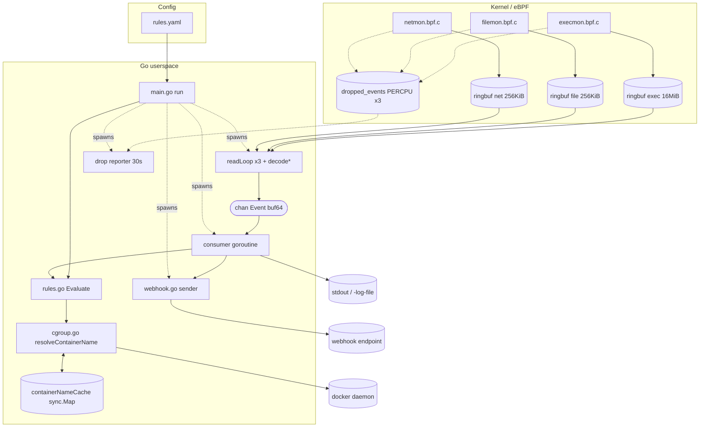
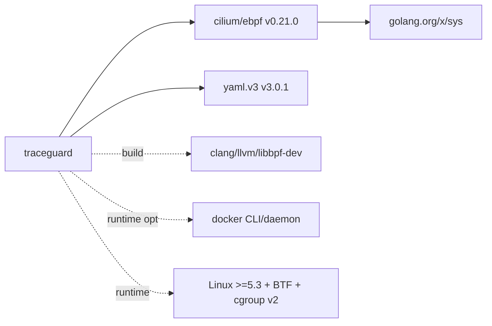

# TraceGuard — Knowledge Graph

> Structured representation of components, relationships, dependencies, entities,
> and workflow connections for machine + human consumption.

## 1. Component graph

## 2. Entity catalog

| Entity | Kind | Defined in | Key attributes |
| --- | --- | --- | --- |
| `Event` | struct | rules.go:13 | Type, PID, PPID, CgroupID, Comm, ParentComm, Filename, Flags, DstIP, DstPort |
| `RuleConfig` | struct | rules.go:33 | ShellSpawn, SensitiveFiles, ReadonlyWrites, NetworkAnomaly |
| `Alert` | struct | rules.go:66 | Rule, Severity, Message, PID, CgroupID, Container, Comm, Filename, Dst |
| `alertJSON` | struct | main.go:334 | + Type="alert", Timestamp |
| `webhookPayload` | struct | webhook.go:16 | Text, Alert |
| `execmonEvent`/`filemonEvent`/`netmonEvent` | generated structs | `*_bpfel.go` | mirror C `struct event` |
| `dropMonitor` | struct | main.go:350 | name, m(*ebpf.Map) |
| `TestCase`/`TestResult`/`Report` | structs | validate/score.go | validation entities |

## 3. Relationship table

| From | Relationship | To |
| --- | --- | --- |
| `execmon/filemon/netmon` | submit to | their RINGBUF map |
| `readLoop` | reads from | RINGBUF map |
| `decodeExec/File/Net` | converts | generated event struct → `Event` |
| reader goroutine | sends to | `out chan Event` |
| consumer | reads from | `out chan Event` |
| consumer | calls | `Evaluate` |
| `Evaluate` | dispatches to | `evalShellSpawn/SensitiveFiles/ReadonlyWrites/NetworkAnomaly` |
| each `eval*` | calls | `resolveContainerName` (on match) |
| `resolveContainerName` | reads/writes | `containerNameCache` |
| `lookupContainerName` | walks | `/sys/fs/cgroup`; shells to `docker inspect` |
| consumer | writes to | stdout / `-log-file` |
| consumer | enqueues to | `webhookCh` (non-blocking) |
| webhook sender | POSTs to | external endpoint |
| reporter | reads | `dropped_events` maps |
| `loadRules` | parses | `rules.yaml` → `RuleConfig` |
| validation scorer | parses | log file `type:"alert"` lines |

## 4. Rule → trigger → output mapping

| Rule | Event type | Trigger condition | Config knobs | Default severity |
| --- | --- | --- | --- | --- |
| unexpected-shell-spawn | exec | comm ∈ shell_names AND parent_comm ∉ allowed_parents | shell_names, allowed_parents | high |
| sensitive-file-access | file_access | filename ∈ paths OR contains any path_substrings | paths, path_substrings | critical |
| readonly-write | file_access | write-flag set AND filename has protected prefix | protected_prefixes | high |
| anomalous-outbound-connection | network | dst_port ∉ allowed_ports | allowed_ports | medium |

## 5. eBPF program ↔ kernel surface

| Program | Tracepoint | Reads | Helper highlights |
| --- | --- | --- | --- |
| execmon | sched/sched_process_exec | task_struct.real_parent (CO-RE), __data_loc filename | BPF_CORE_READ, bpf_get_current_comm/cgroup_id |
| filemon | syscalls/sys_enter_openat | args[1] filename (user), args[2] flags | bpf_probe_read_user_str, bounded marker scan |
| netmon | syscalls/sys_enter_connect | args[1] sockaddr_in (user) | bpf_probe_read_user, bpf_ntohs |

## 6. Dependency graph

| Dependency | Type | Load-bearing? | Replacement |
| --- | --- | --- | --- |
| cilium/ebpf | direct | **yes** (whole eBPF layer + bpf2go) | libbpfgo (heavier, cgo) |
| yaml.v3 | direct | low | any YAML / JSON |
| golang.org/x/sys | indirect | low | — |
| clang/llvm/libbpf-dev | build | yes (eBPF compile) | none |
| docker | runtime opt | no (degrades gracefully) | containerd/CRI (not impl) |

## 7. Workflow connection map

| Workflow | Entry | Touches | Exit |
| --- | --- | --- | --- |
| Startup | `main()`→`run()` | loadRules, rlimit, 3× load/attach/reader, goroutine spawn | banner, blocks on wg |
| Event hot path | tracepoint | eBPF→ringbuf→readLoop→decode→out→consumer→Evaluate→cgroup→output | alert line(s) |
| Webhook delivery | consumer `sendAlert` | webhookCh→sender→HTTP POST | endpoint (or drop) |
| Drop monitoring | 30s ticker | readDropped over PERCPU maps | stderr warnings + run summary |
| Shutdown | SIGINT/SIGTERM | close readers/reporterStop→wg.Wait→close(out)→drain→flush webhook | exit 0 |
| Validation | `validate` main | setup victim, run suite, loadAlerts, score | report (det%/fp%) |
| CI/CD | git push | generate/vet/test/build → docker push | ghcr.io image |

## 8. Concurrency entity map

| Goroutine | Count | Reads | Writes | Stops on |
| --- | --- | --- | --- | --- |
| reader (readLoop) | 3 | ring buffer | `out` chan | ring `ErrClosed` |
| drop reporter | 1 | dropped_events | stderr | `reporterStop` |
| consumer | 1 | `out` chan | stdout/log, `webhookCh` | `out` closed |
| webhook sender | 0–1 | `webhookCh` | HTTP | `webhookCh` closed |
| signal handler | 1 | OS signals | closes readers/reporterStop | after one signal |

## 9. Known-limitation nodes (blind spots, for reasoning)
- comm-based container shell attribution (no per-cgroup lineage)
- `openat` only (no legacy `open`)
- `/etc/` kernel fast-path is absolute-path only (relative-dirfd bypass)
- IPv4 only (no IPv6/AF_UNIX)
- no cross-monitor correlation
- no chmod/ptrace/module-load coverage
- cgroup **v2** + **Docker** assumed for naming
</content>
