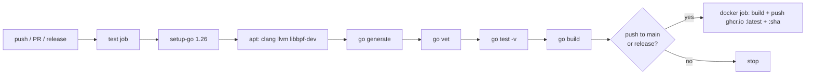

# TraceGuard — Deployment & Operations Guide

> Source: `Dockerfile`, `.github/workflows/ci.yml`, `main.go`, `README.md`.

## 1. Deployment model

TraceGuard is a **single long-running daemon per host**. To monitor a fleet, run
one instance per node (e.g. a Kubernetes DaemonSet — not provided, but the natural
shape). It is **not** clustered; instances are independent and share no state.

### 9. Configuration & environment

There are **no environment variables** read by the application and **no secrets
files**. All configuration is via CLI flags + the YAML rule file.

| Input | Type | Required | Default | Example |
| --- | --- | --- | --- | --- |
| `-rules` | flag (path) | no | `rules.yaml` | `/etc/traceguard/rules.yaml` |
| `-verbose` | flag (bool) | no | off | `-verbose` |
| `-log-file` | flag (path) | no | stdout only | `/var/log/traceguard.log` |
| `-webhook` | flag (URL) | no | disabled | `https://hooks.slack.com/services/...` |
| `rules.yaml` | config file | yes (default path) | see repo | the four rule sections |

**The webhook URL is the only sensitive value** (a Slack URL is a bearer secret).
It is passed on the command line — visible in `ps`/process listing. (Assumption /
improvement: for production, source it from a file or env and avoid argv exposure;
not currently supported.)

### Runtime privileges & mounts (Docker)
| Requirement | Why |
| --- | --- |
| `--privileged` or `CAP_BPF`+`CAP_SYS_ADMIN` | load eBPF + attach tracepoints |
| `-v /sys/kernel/btf:...:ro` | CO-RE relocation against host BTF |
| `-v /sys/kernel/debug:...:rw` | tracepoint attach via perf_event_open (tracefs) |
| host PID/cgroup + docker socket (not in default cmd) | only for container-name resolution |

The runtime image has **no `USER` directive** on purpose — it must start with the
elevated caps supplied at `docker run` time.

## 2. Build & release pipeline

- Image registry: `ghcr.io/<repository>`.
- Tags: `latest` and the commit `:sha`.
- Auth: `secrets.GITHUB_TOKEN` (repo-scoped, `packages: write`).

## 3. Infrastructure assumptions
- Target hosts are **Linux x86_64**, kernel ≥ 5.3, BTF-enabled, cgroup **v2**.
- **Docker** is the container runtime if container-name resolution is wanted.
- No external datastore, message broker, or service dependency — only an optional
  outbound HTTPS endpoint for the webhook.

## 4. Monitoring & observability

TraceGuard is itself a monitoring tool; its **own** observability is via stderr:
- **Startup banner** confirms all three monitors attached.
- **Drop warnings** every 30s when any per-CPU `dropped_events` counter climbs —
  the primary health signal that the host is overwhelming a ring buffer.
- **Per-run drop summary** at shutdown (always printed; zeros = clean run).
- **Error lines** for read/decode/marshal/webhook failures.

There are **no metrics endpoint, no Prometheus exporter, no healthcheck**.
(Improvement opportunity: expose drop counters + event rates via a metrics port.)

### Recommended operational alerts (external)
- Rising `dropped ... events` → ring buffer too small or host too busy.
- `webhook: queue full, dropping alert` → alert volume exceeds delivery rate.
- Process exit / non-zero exit code → daemon down (no auto-restart built in; use
  systemd `Restart=always` or a k8s restartPolicy).

## 5. Logging

- **Data plane**: NDJSON alerts to stdout and/or `-log-file` (append mode, 0644).
- **Control plane**: human messages to stderr.
- **Rotation**: none built in — `-log-file` grows unbounded. Use `logrotate`
  (with `copytruncate`, since the file is held open `O_APPEND`) or ship stdout to
  a collector and skip `-log-file`.

## 6. Error handling & resilience (operational view)
- Backpressure is **lossy by design** (drop + count) — TraceGuard never blocks the
  monitored host. Tune ring sizes if drops are unacceptable.
- Webhook delivery is **best-effort, no retry** — pair with a durable collector if
  guaranteed delivery matters.
- A single bad ring read backs off 100ms; persistent failures log continuously.

## 7. Rollback procedures
- **Binary/image**: redeploy a previous `ghcr.io/<repo>:<sha>` tag. Stateless, so
  rollback is just restart-with-old-image.
- **Rule change gone wrong** (noisy/over-broad rule): revert `rules.yaml` and
  restart. No migration, no persisted state to unwind. Keep `rules.yaml` in
  version control alongside deployments.
- **No data migrations exist** (no DB), so rollbacks are risk-free w.r.t. state.

## 8. Capacity & scaling notes
- Per-host CPU overhead measured at ~5.23% under a 700 exec/s burst in `-verbose`,
  and <0.5% in steady-state alerts-only mode (`README.md`). Run **without
  `-verbose`** in production.
- The exec ring buffer is 16 MiB; file/net are 256 KiB each. High-volume
  file/connect hosts may need larger file/net buffers (raise `max_entries` in the
  `.bpf.c`, re-`go generate`, rebuild).
- Scaling is horizontal-by-host only; there is no aggregation tier (a v2 concern).
</content>
