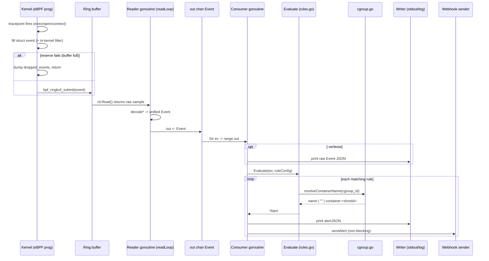
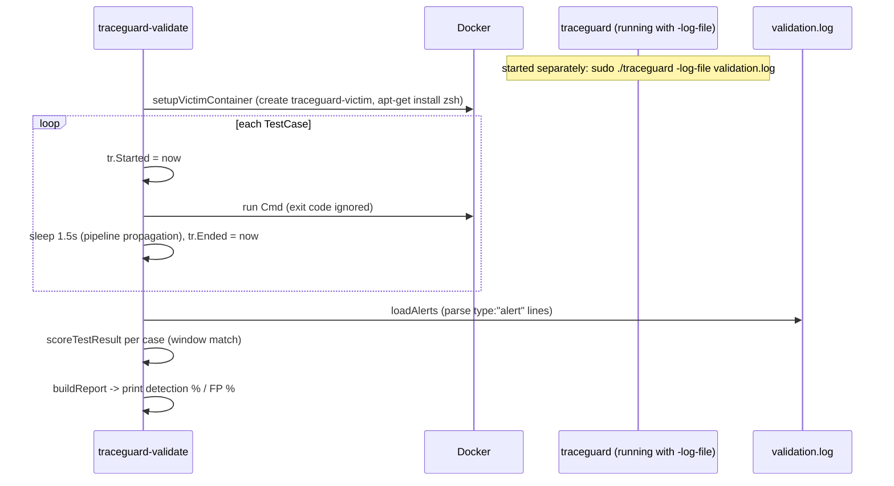

# TraceGuard — Key Workflows

> Source: `main.go` (`run`, `readLoop`, decoders, consumer), `rules.go`
> (`Evaluate`), `cgroup.go`, `webhook.go`, `validate/`.

## 1. End-to-end event lifecycle (the hot path)



## 2. Startup workflow (`run()` in main.go)

1. Parse flags (`-rules`, `-verbose`, `-log-file`, `-webhook`).
2. `loadRules()` — read + YAML-unmarshal the rule file. **Fatal on failure.**
3. If `-webhook`: validate URL (parse + http/https scheme; warn on plaintext),
   create `webhookCh` (buffer 100), `startWebhookSender`.
4. Configure output writer: stdout, or `io.MultiWriter(stdout, logfile)`.
5. `rlimit.RemoveMemlock()` — lift memlock so eBPF maps load on older kernels.
6. For each of exec/file/net: `loadXObjects` → `link.Tracepoint(...)` →
   `ringbuf.NewReader(...)`. Each step is `defer`-closed.
7. Create shared `out chan Event` (buffer 64).
8. Install SIGINT/SIGTERM handler that closes the 3 readers + `reporterStop`.
9. Query `ebpf.PossibleCPU()`; build `dropMonitors` list.
10. Spawn 3 reader goroutines + 1 drop-reporter goroutine (`wg.Add(4)` total).
11. Spawn the consumer goroutine.
12. Print banner; `wg.Wait()` → `close(out)` → `<-done` → final drop summary →
    flush+close webhook channel → deferred closes.

## 3. Shutdown workflow

```mermaid
sequenceDiagram
    participant U as User (Ctrl-C)
    participant SIG as Signal goroutine
    participant RD as 3 readers + reporter
    participant M as run() main flow
    participant P as Consumer (printer)
    participant WS as Webhook sender
    U->>SIG: SIGINT/SIGTERM
    SIG->>RD: close ring readers + close(reporterStop)
    RD-->>M: all 4 goroutines return (wg unblocks)
    M->>P: close(out)
    P-->>M: drains, close(done); M does <-done
    M->>M: print per-run drop summary (maps still open)
    M->>WS: close(webhookCh); webhookWG.Wait() (flush queued)
    M->>M: deferred Close() of readers/links/objects
```

## 4. Per-monitor decode workflows

- **decodeExec** (main.go:399): `binary.Read` → `execmonEvent` → `Event{Type:"exec", PID, PPID, CgroupID, Comm, ParentComm, Filename}`.
- **decodeFile** (main.go:416): → `Event{Type:"file_access", PID, Flags, CgroupID, Comm, Filename}`.
- **decodeNet** (main.go:432): → `Event{Type:"network", PID, CgroupID, Comm, DstIP=net.IP(...).String(), DstPort}`.

`goString` (main.go:449) cuts each fixed C buffer at its first NUL.

## 5. Rule evaluation workflow (`Evaluate`, rules.go:190)

```
Evaluate(event, cfg):
  alerts = []
  for eval in [evalShellSpawn, evalSensitiveFiles, evalReadonlyWrites, evalNetworkAnomaly]:
      a = eval(event, cfg.<section>)
      if a != nil: alerts += a       # each eval gates on Enabled + event.Type first
  return alerts
```
Order is fixed; multiple matches per event are possible (e.g. write to
`/etc/...` matching both sensitive-file and readonly-write conceptually — note
`sensitive-file-access` matches by path regardless of read/write).

## 6. Container-name resolution workflow (`cgroup.go`)

```mermaid
flowchart TD
  A[resolveContainerName cgroup_id] --> B{in cache?}
  B -- yes --> Z[return cached]
  B -- no --> C[findCgroupPath: walk /sys/fs/cgroup, stat each dir]
  C -- no match --> E["return \"\" (host/not container)"]
  C -- match --> D[containerIDFromCgroupPath]
  D -- not docker --> E
  D -- 64-hex id --> F["docker inspect --format {{.Name}} (2s timeout)"]
  F -- ok --> G[trim -> name]
  F -- fail/timeout --> H["container:<shortid>"]
  G --> I[cache + return]
  H --> I
  E --> I
```
The result (including `""` and fallbacks) is cached in `containerNameCache`.

## 7. Validation workflow (`validate/`)



**Scoring rules** (`scoreTestResult`): an alert belongs to a test if its
`timestamp ∈ [Started, Ended]`. An **attack** passes if its `ExpectRule` appears
in-window; a **benign** case passes only if its window is **empty**.

**Suite design guards** (avoid measuring artifacts):
- Shell-spawn attacks run as direct `argv` (not host `bash -c`, which would itself
  trip `unexpected-shell-spawn` from the validator's own parent).
- Benign container cases use non-shell entrypoints (`echo`/`cat`/`ls`/`cp`).
- The zsh victim container is provisioned **before** the timed loop so the
  install's own shells land outside every window.

## 8. Performance-measurement workflow (`perf_test.sh` / `perf_steadystate.sh`)
1. Start traceguard separately (`-verbose -log-file perf.log`, or non-verbose for
   steady-state).
2. Script finds its PID via `pgrep -f './traceguard'`, snapshots
   utime+stime from `/proc/<pid>/stat`.
3. Runs `/bin/true` 2000× as fast as possible, sleeps 1s to flush.
4. Computes elapsed, exec rate, captured rate (verbose only), and CPU %.

> User journeys are operator-facing only (run, observe alerts, tune
> `rules.yaml`); there is no end-user UI. See [DEVELOPMENT_GUIDE](./DEVELOPMENT_GUIDE.md).
</content>
